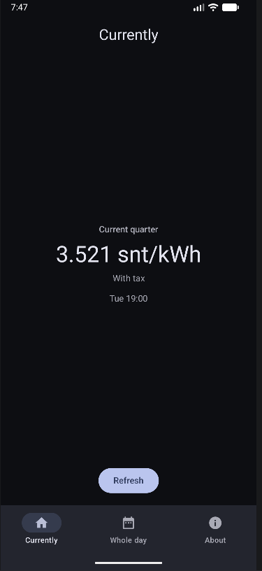
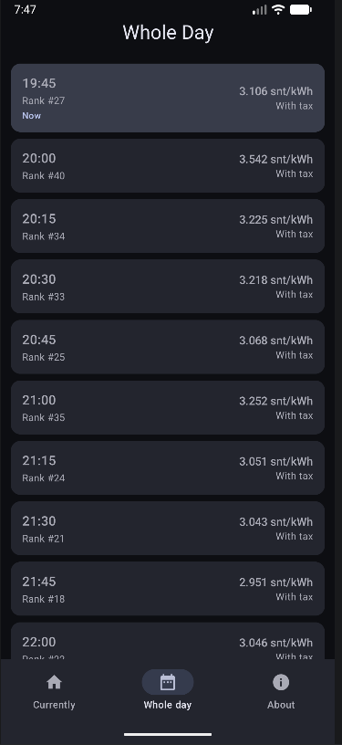

# Pörssisähkö Android App

Secure and minimal Android app to check the current electricity price in Finland.

<div style="display:flex;gap:12px;align-items:center;justify-content:center;flex-wrap:nowrap">
  
  
</div>

## Installing using [Obtainium](https://obtainium.imranr.dev/)

Simply copy this JSON snippet and paste it into Obtainium!

```json
{"id":"dev.vili.spot","url":"https://github.com/vil/spot","author":"Vili","name":"Pörssisähkö","preferredApkIndex":0,"additionalSettings":"{\"includePrereleases\":false,\"fallbackToOlderReleases\":true,\"filterReleaseTitlesByRegEx\":\"\",\"filterReleaseNotesByRegEx\":\"\",\"verifyLatestTag\":true,\"dontSortReleasesList\":false,\"useLatestAssetDateAsReleaseDate\":false,\"trackOnly\":false,\"versionExtractionRegEx\":\"\",\"matchGroupToUse\":\"\",\"versionDetection\":true,\"releaseDateAsVersion\":false,\"useVersionCodeAsOSVersion\":false,\"apkFilterRegEx\":\"\",\"invertAPKFilter\":false,\"autoApkFilterByArch\":true,\"appName\":\"Pörssisähkö\",\"exemptFromBackgroundUpdates\":false,\"skipUpdateNotifications\":false,\"about\":\"Secure and minimal Android app to check the current electricity price in Finland.\",\"appAuthor\":\"Vili\"}"}
```

## Signing key fingerprints

```
SHA1: EB:8F:58:90:A7:97:53:1D:83:9D:E3:ED:BC:EF:31:27:A7:62:1D:FC
SHA256: 03:65:47:32:EC:9A:B8:D0:A7:B7:6E:F6:F3:91:55:5E:59:EC:42:4D:0A:FF:4B:A8:6A:22:3F:60:EB:32:BF:A4
```

## Permissions

This app requires only one Android permission:

- `android.permission.INTERNET`

The permission is declared in the app manifest (see `app/src/main/AndroidManifest.xml`) and is used only to fetch spot price data from the public API (spot-hinta.fi). No other runtime or sensitive permissions are requested.

## Verifying the installed app (AppVerifier)

1. Install the APK on the device.
2. Open the AppVerifier app on the device.
3. In AppVerifier:
   - Select the installed app (Pörssisähkö) or point the tool to the APK file.
   - View the app's signing certificate details: the tool should display certificate fingerprints (SHA1/SHA256).
4. Compare the displayed SHA1 and SHA256 fingerprints against the "Signing key fingerprints" listed in this README. If they match, the app is signed with the expected key.

## License

This app is under the MIT License.
